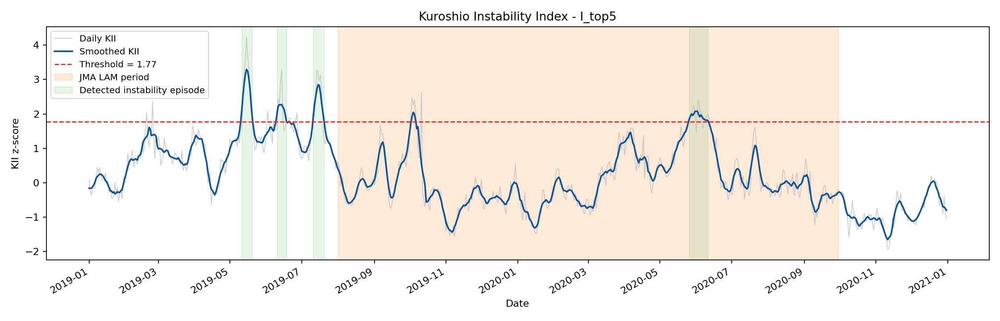
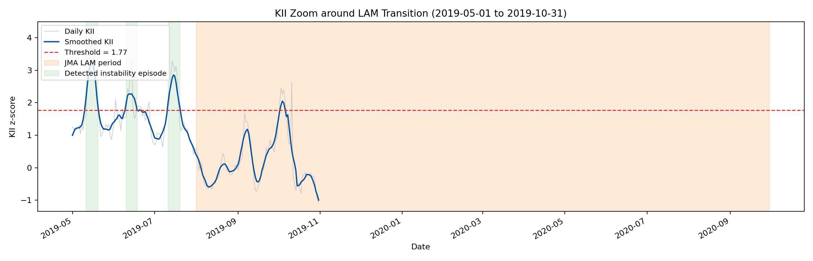

# Kuroshio Current Anomaly Detection and Instability Index

This project develops an unsupervised deep-learning framework for detecting localized anomalous structures in the Kuroshio Current using reconstruction error from a convolutional autoencoder trained on quiescent-period ocean reanalysis data.

**Main result:** localized reconstruction error is more useful as a **Kuroshio Instability Index (KII)** than as a strict binary classifier for mature large-amplitude meander (LAM) labels. In the current 2019-2020 test period, KII highlights persistent instability episodes, especially before the simplified LAM reference window used in this prototype.

---

# Main Results

## 1. Kuroshio Instability Index during 2019-2020

<p align="center">
  
</p>


The gray curve shows daily KII, and the blue curve shows the 7-day smoothed KII. The red dashed line is the validation-calibrated instability threshold. Green shaded intervals are detected persistent instability episodes. The orange shaded region is the simplified 2019-2020 LAM reference window used only for weak comparison in this prototype.

The key observation is that KII is not continuously high throughout the mature reference period. Instead, it identifies several localized, persistent instability episodes, especially in 2019 before the simplified reference window. This suggests that the model is more sensitive to transition-stage or localized dynamical instability than to the mature LAM state itself.

---

## 2. Zoomed view around the 2019 transition-stage period

<p align="center">
  
</p>

 
The zoomed view shows three clear high-KII episodes before 2019-08-01, which is the beginning of the simplified LAM reference window used in this prototype. These pre-reference episodes are important because they would be counted as false positives under a strict binary LAM-classification metric, but they may instead indicate physically meaningful localized instability or transition-stage behavior.

---

## 3. Persistent instability episodes detected by KII

Using the top-5% localized reconstruction-error statistic, the current experiment detects the following persistent KII episodes:

| Episode | Start date | End date | Duration | Peak date | Peak KII | Interpretation |
|---:|---|---|---:|---|---:|---|
| 1 | 2019-05-11 | 2019-05-20 | 10 days | 2019-05-15 | 3.294 | Pre-reference instability |
| 2 | 2019-06-10 | 2019-06-18 | 9 days | 2019-06-14 | 2.272 | Pre-reference instability |
| 3 | 2019-07-11 | 2019-07-20 | 10 days | 2019-07-15 | 2.852 | Pre-reference instability |
| 4 | 2020-05-26 | 2020-06-11 | 17 days | 2020-06-01 | 2.080 | Instability during reference period |

**Result summary.**  
The first three episodes occur before the simplified LAM reference window. Therefore, the model output should not be interpreted only as a mature-LAM label. A more appropriate interpretation is that localized reconstruction error provides an unsupervised signal of Kuroshio dynamical instability.

---

# Research Reframing

The project was originally designed as an unsupervised Kuroshio large-amplitude meander anomaly detection system. The current version reframes the model output as a physics-oriented instability diagnostic:

> **Localized reconstruction error is interpreted as a Kuroshio Instability Index, rather than only as a binary LAM detection score.**

This reframing is motivated by the observation that the highest-KII events are not simply aligned with the entire mature reference period. Instead, the model detects localized and persistent high-error episodes that may correspond to transition-stage instability.

The simplified reference window currently used for weak comparison is:

```text
2019-08-01 to 2020-09-30
```

This is used only as a prototype reference window. It should not be interpreted as a complete official event catalog.

---

# Future Work

Future extensions will focus on making the KII more physically interpretable and more closely connected to applied physical oceanography:

1. Compare high-KII regions with vorticity, current-speed gradients, strain, and eddy kinetic energy.
2. Analyze whether high-KII episodes are spatially concentrated near topographic control regions such as the Kii Peninsula and Izu Ridge.
3. Incorporate sea surface height anomaly and sea surface temperature as additional input channels.
4. Examine whether current-side instability signals may be relevant to wave-current interaction and marine safety applications.
5. Compare KII episodes with higher-resolution operational or data-assimilation products when available.

---

# Method Overview

## Data

| Component | Setting |
|---|---|
| Data source | CMEMS / GLORYS12v1 ocean reanalysis |
| Variables | Surface zonal and meridional current velocity (`uo`, `vo`) |
| Spatial domain | 130°E-145°E, 25°N-40°N |
| Depth | Surface layer |
| Training period | 2010-2016 |
| Validation period | 2017-2018 |
| Test period | 2019-2020 |
| Main KII ROI | 132°E-140°E, 30°N-35°N |

The autoencoder is trained only on the quiescent-period training subset. Validation data are used to calibrate anomaly and KII thresholds.

## Model

The model is a convolutional autoencoder with two input channels: zonal velocity `u` and meridional velocity `v`.

For each daily frame, the pixel-level reconstruction error is computed as:

```text
E(i, j, t) = (u_hat(i, j, t) - u(i, j, t))^2 + (v_hat(i, j, t) - v(i, j, t))^2
```

The resulting 2D error map is used to generate spatial anomaly heatmaps and scalar time-series indices.

## Kuroshio Instability Index

The KII is defined from localized reconstruction-error statistics within the Kuroshio region of interest.

In the current main experiment, the index uses the mean of the top 5% highest-error ocean pixels:

```text
I_top5(t) = mean of the highest 5% reconstruction-error values in the ROI
```

The raw score is normalized using the validation-period distribution:

```text
KII(t) = (I_top5(t) - mean_validation) / std_validation
```

Current configuration:

| Parameter | Value |
|---|---:|
| KII score | `I_top5` |
| ROI | 132°E-140°E, 30°N-35°N |
| Validation mean | 14.590 |
| Validation std | 3.528 |
| Smoothing window | 7 days |
| Threshold | 95th percentile of validation KII |
| Threshold value | 1.771 z-score |
| Minimum episode duration | 5 days |

A day is classified as part of an instability episode when the smoothed KII exceeds the validation-calibrated threshold for at least five consecutive days.

---

# Pre-reference-window Analysis

For the simplified reference onset date of 2019-08-01, KII is elevated in the preceding 30-, 60-, and 90-day windows:

| Window before reference onset | Mean KII | Max KII | Days above threshold | Fraction above threshold |
|---:|---:|---:|---:|---:|
| 30 days | 1.490 | 2.852 | 10 | 0.333 |
| 60 days | 1.599 | 2.852 | 20 | 0.333 |
| 90 days | 1.657 | 3.294 | 30 | 0.333 |

This supports the interpretation that the model output may be more useful as an instability-oriented diagnostic than as a direct mature-LAM classifier.

---

# Weak Reference Comparison with LAM Window

When KII is evaluated as a strict binary classifier against the simplified reference window, the F1 score is low. This is expected because the goal of KII is not to reproduce a mature LAM label for every day of the reference period.

Several high-KII episodes occur before the reference window and are therefore counted as false positives under a binary F1 calculation. In this research framing, however, they are treated as candidate transition-stage or localized instability signals.

Therefore, F1 is reported only as a secondary diagnostic. The primary results are:

- the KII time series,
- persistent instability episodes,
- pre-reference-window intensification behavior,
- and the physical interpretation of localized reconstruction error.

---

# Repository Structure

```text
kuroshio_autoencoder/
├── download_data.py
├── preprocess.py
├── model.py
├── train.py
├── evaluate.py
├── instability_index.py
├── run_kii.py
├── requirements.txt
├── figures/
│   ├── kii_timeseries_2019_2020.png
│   └── kii_zoom_transition_2019.png
└── results/
    └── kii/
        ├── instability_episodes.csv
        ├── pre_lam_window_stats.csv
        └── kii_metadata.json
```

---

# Reproduction Instructions

This section is placed after the results because the primary purpose of this repository is to communicate the research result first. The commands below reproduce the current outputs.

## 1. Install dependencies

```bash
pip install -r requirements.txt
```

## 2. Prepare data

If raw CMEMS files are already available under `data/raw/`, run:

```bash
python preprocess.py
```

If processed files already exist under `data/processed/`, this step can be skipped.

## 3. Train the autoencoder

If a trained checkpoint already exists at `checkpoints/best_model.pt`, this step can be skipped.

```bash
python train.py --epochs 100 --batch_size 16 --device cuda
```

## 4. Evaluate and generate KII results

```bash
python evaluate.py \
  --checkpoint checkpoints/best_model.pt \
  --device cpu \
  --batch_size 8 \
  --score_mode topk_mean \
  --topk_percent 5.0 \
  --percentile 85.0 \
  --kii_score I_top5 \
  --kii_percentile 95.0 \
  --smooth_window 7 \
  --min_duration 5 \
  --top_n 5
```

---

# Main Output Files

| File | Purpose |
|---|---|
| `figures/kii_timeseries_2019_2020.png` | Main KII time-series visualization |
| `figures/kii_zoom_transition_2019.png` | Zoomed view around the 2019 transition-stage period |
| `results/kii/instability_episodes.csv` | Persistent high-KII episodes |
| `results/kii/pre_lam_window_stats.csv` | KII behavior before the simplified reference onset |
| `results/kii/kii_metadata.json` | KII configuration and threshold metadata |

---

# Limitations

This project is still a prototype and has several limitations:

- The simplified LAM reference window is used only for weak comparison and does not replace a complete official catalog.
- KII is currently based only on surface current velocity fields (`u`, `v`).
- The current version does not yet incorporate sea surface height, vorticity, eddy kinetic energy, bathymetry, wind, or wave variables.
- The current method should not be described as LAM prediction. It should be described as an unsupervised diagnostic of localized Kuroshio instability.

---

# One-sentence Interpretation

The convolutional autoencoder does not simply reproduce a mature LAM label; instead, its localized reconstruction error can be interpreted as a Kuroshio Instability Index that highlights persistent transition-stage instability episodes in the Kuroshio region.
