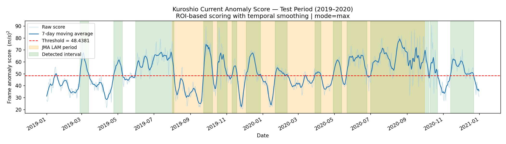

# Kuroshio Current Anomaly Detection via Convolutional Autoencoder

Unsupervised anomaly detection of Kuroshio Current structures using reconstruction error from a convolutional autoencoder trained on quiescent-period CMEMS reanalysis data, with evaluation against documented large-amplitude meander (LAM) events.

---

## Project Structure

```
kuroshio_autoencoder/
├── download_data.py   Step 1 — Download GLORYS12v1 daily u/v from CMEMS
├── preprocess.py      Step 2 — Land mask · normalise · train/val/test split
├── model.py           Model definition: KuroshioAutoencoder + loss functions
├── train.py           Step 3 — Train the autoencoder (2010–2016 quiescent frames)
├── evaluate.py        Step 4 — Inference, heatmaps, score time-series, stats
├── requirements.txt
└── README.md
```

---

## Quick Start

### 1. Install dependencies

```bash
pip install -r requirements.txt
```

### 2. Register for free CMEMS access

Create a free account at https://marine.copernicus.eu and then run:

```bash
copernicusmarine login
```

### 3. Download data (2010–2020, ~3–4 GB)

```bash
python download_data.py
```

### 4. Preprocess

```bash
python preprocess.py
```

Outputs:
- `data/processed/kuroshio_frames.npy`  — float32 (N, 2, H, W)
- `data/processed/land_mask.npy`        — bool (H, W)
- `data/processed/norm_stats.npz`       — per-channel mean/std
- `data/processed/split_indices.npz`    — train/val/test indices

### 5. Train

```bash
python train.py --epochs 100 --batch_size 16 --device cuda
```

### 6. Evaluate

```bash
python evaluate.py --checkpoint checkpoints/best_model.pt \
                   --percentile 95 --device cpu
```

Outputs in `results/`:
- `anomaly_scores.csv`
- `score_timeseries.png`
- `heatmaps/`

---

## Results Visualization

### Anomaly Score Time Series



### Spatial Error Heatmaps

| Normal State | Anomalous State |
|-------------|----------------|
|  |  |

---

## Research Design

| Component          | Detail |
|--------------------|--------|
| Data source        | CMEMS GLORYS12v1 daily 1/12° reanalysis |
| Domain             | 130°E–145°E, 25°N–40°N |
| Input channels     | u, v surface velocity |
| Training period    | 2010–2016 (quiescent) |
| Validation period  | 2017–2018 |
| Test period        | 2019–2020 |
| Architecture       | 4-layer symmetric Conv AE |
| Anomaly criterion  | Masked MSE reconstruction error |
| Ground truth       | JMA LAM catalog |

---

## Experimental Findings

The autoencoder-based framework successfully captures anomalous ocean states, as reflected by elevated reconstruction error during periods of strong flow variability.

However, the detected anomalies do not fully align with documented Kuroshio large-amplitude meander (LAM) events.

---

## Citation

Tong, C. (2025)
