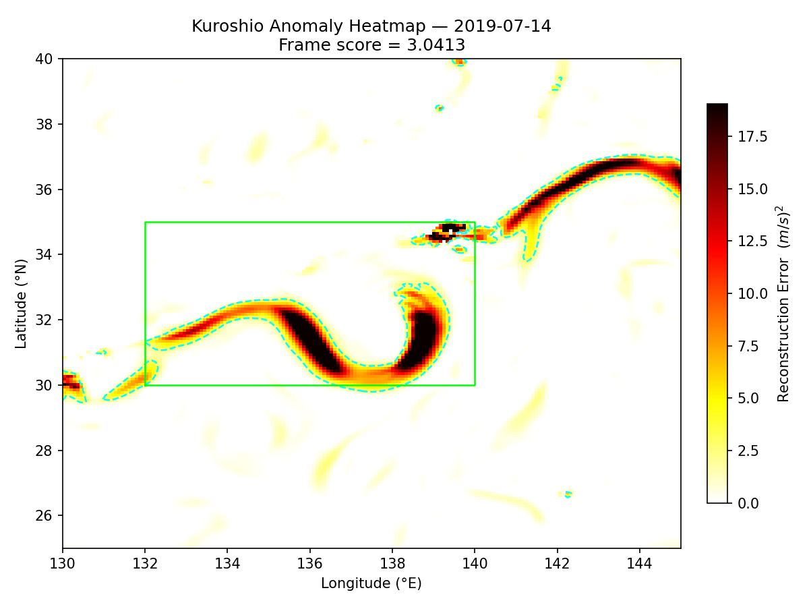

# Kuroshio Current Anomaly Detection via Convolutional Autoencoder

Unsupervised anomaly detection of Kuroshio Current dynamical structures using reconstruction error from a convolutional autoencoder trained on quiescent-period CMEMS reanalysis data, with evaluation of their temporal and spatial correspondence to documented large-amplitude meander (LAM) events.

---

## Key Result Example

### Temporal Evolution of Anomaly Score

The anomaly score increases during periods of strong dynamical variability and partially aligns with the documented LAM period.


---

### Spatial Localization of Anomalous Structures

Reconstruction error maps highlight localized regions of strong deviation along the Kuroshio path.



---

## Project Structure

```
kuroshio_autoencoder/
├── download_data.py
├── preprocess.py
├── model.py
├── train.py
├── evaluate.py
├── requirements.txt
└── README.md
```

---

## Quick Start

### 1. Install dependencies

```bash
pip install -r requirements.txt
```

### 2. Register for CMEMS

```bash
copernicusmarine login
```

### 3. Download data

```bash
python download_data.py
```

### 4. Preprocess

```bash
python preprocess.py
```

### 5. Train

```bash
python train.py --epochs 100 --batch_size 16 --device cuda
```

### 6. Evaluate

```bash
python evaluate.py --checkpoint checkpoints/best_model.pt --device cpu
```

---

## Research Design

| Component          | Detail |
|--------------------|--------|
| Data source        | CMEMS GLORYS12v1 |
| Domain             | 130°E–145°E, 25°N–40°N |
| Input channels     | u, v |
| Training period    | 2010–2016 |
| Validation period  | 2017–2018 |
| Test period        | 2019–2020 |
| Architecture       | Conv Autoencoder |
| Anomaly criterion  | Reconstruction error (top-k / max within ROI) |
| Ground truth       | JMA LAM catalog |

---

## Key Results

### Detection Performance

| Scoring Method | Precision | Recall | F1 Score |
|----------------|----------|--------|----------|
| Mean (baseline) | 0.51 | 0.02 | 0.07 |
| Top-k (10%)     | 0.62 | 0.02 | 0.11 |
| Top-k (5%)      | 0.88 | 0.09 | 0.16 |
| **Max (proposed)** | **0.98** | **0.51** | **0.67** |

The results demonstrate that localized anomaly scoring significantly improves detection performance.

---

### Key Insight

The model detects dynamical instability (especially pre-LAM), but is less sensitive to mature LAM states, suggesting it captures instability rather than regime shifts.
